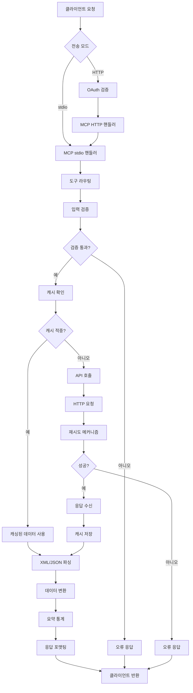
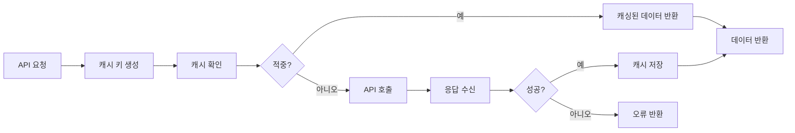

# Korea Real Estate MCP - Data Flow

## 데이터 흐름 개요

시스템의 데이터는 4단계를 거쳐 처리됩니다:
1. **수신 (Ingest)**: 클라이언트 요청 수신
2. **처리 (Process)**: 비즈니스 로직 실행
3. **변환 (Transform)**: 데이터 포맷 변환
4. **반환 (Return)**: 클라이언트 응답 반환

---

## 1. 요청 수신 흐름 (Request Ingestion Flow)

### 1.1 stdio 모드 (Claude Desktop)

```
┌──────────────┐
│ Claude Desktop│
└──────┬───────┘
       │
       │ 1. 사용자 자연어 입력
       │    "서울 강남구 아파트 최근 매매가 알려줘"
       ▼
┌──────────────────────────────────────┐
│      Claude AI Processing            │
│  - 의도 파악: get_apartment_trades   │
│  - 파라미터 추출: "강남구"            │
└──────┬───────────────────────────────┘
       │
       │ 2. MCP Tool Call (JSON-RPC)
       │    {
       │      "method": "tools/call",
       │      "params": {
       │        "name": "get_region_code",
       │        "arguments": {"query": "강남구"}
       │      }
       │    }
       ▼
┌──────────────────────────────────────┐
│    MCP Server (stdio)                │
│  - JSON-RPC 메시지 수신              │
│  - 도구 라우팅                      │
└──────┬───────────────────────────────┘
       │
       │ 3. 도구 실행
       ▼
┌──────────────────────────────────────┐
│    get_region_code                  │
│  - 지역명 검색                      │
│  - 지역코드 반환                    │
└──────────────────────────────────────┘
```

### 1.2 HTTP 모드 (웹 클라이언트)

```
┌──────────────┐
│ 웹 브라우저   │
└──────┬───────┘
       │
       │ 1. HTTPS 요청
       │    POST /mcp
       │    Authorization: Bearer {token}
       ▼
┌──────────────────────────────────────┐
│    OAuth Verify Middleware           │
│  - 토큰 추출                        │
│  - 토큰 검증                        │
└──────┬───────────────────────────────┘
       │
       │ 2. 토큰 유효 확인
       ▼
┌──────────────────────────────────────┐
│    MCP HTTP Handler                  │
│  - HTTP → JSON-RPC 변환             │
│  - stdio 모방                       │
└──────┬───────────────────────────────┘
       │
       │ 3. 도구 실행 (stdio와 동일)
       ▼
┌──────────────────────────────────────┐
│    MCP Tool Execution                │
└──────────────────────────────────────┘
```

---

## 2. 데이터 처리 흐름 (Data Processing Flow)

### 2.1 매매가 조회 데이터 흐름

```
┌─────────────────────────────────────────────────────────┐
│               Tool Invocation                           │
│  get_apartment_trades(region_code="11680",             │
│                        year_month="202401")             │
└──────────────────────┬──────────────────────────────────┘
                       │
                       ▼
┌─────────────────────────────────────────────────────────┐
│               Input Validation                          │
│  - validate_region_code("11680") → True                │
│  - validate_year_month("202401") → True                │
└──────────────────────┬──────────────────────────────────┘
                       │
                       ▼
┌─────────────────────────────────────────────────────────┐
│               Cache Check                               │
│  - generate_cache_key(url, params)                     │
│  - cache.get(key) → None (cache miss)                  │
└──────────────────────┬──────────────────────────────────┘
                       │
                       ▼
┌─────────────────────────────────────────────────────────┐
│               API Call                                  │
│  - URL 생성:                                           │
│    https://api.odcloud.kr/api/Req/v1?                  │
│    serviceKey={KEY}&LAWD_CD=11680&DEAL_YMD=202401     │
│  - _fetch_xml(url)                                     │
│    ├─ httpx.AsyncClient.get()                          │
│    ├─ 10초 타임아웃                                    │
│    └─ 재시도 (최대 3회, 지수 백오프)                  │
└──────────────────────┬──────────────────────────────────┘
                       │
                       ▼
┌─────────────────────────────────────────────────────────┐
│               Response Processing                       │
│  - XML 수신                                            │
│  - 오류 확인                                           │
│  - cache.set(key, (xml, None))                         │
└──────────────────────┬──────────────────────────────────┘
                       │
                       ▼
┌─────────────────────────────────────────────────────────┐
│               XML Parsing                               │
│  - parse_trade_response(xml_text)                      │
│  - xmltodict.parse(xml_text)                           │
│  - 데이터 추출 및 변환                                  │
│  - 가격: str → int ("100,000" → 100000)                │
│  - 요약 통계 계산                                       │
└──────────────────────┬──────────────────────────────────┘
                       │
                       ▼
┌─────────────────────────────────────────────────────────┐
│               Response Formatting                       │
│  {                                                    │
│    "success": true,                                    │
│    "data": [...],                                      │
│    "summary": {                                        │
│      "count": 150,                                     │
│      "avg_price": 125000000,                           │
│      "min_price": 80000000,                            │
│      "max_price": 250000000                            │
│    },                                                  │
│    "count": 150                                        │
│  }                                                     │
└──────────────────────┬──────────────────────────────────┘
                       │
                       ▼
┌─────────────────────────────────────────────────────────┐
│               Return to Client                          │
│  - JSON-RPC 응답                                      │
│  - Claude Desktop으로 전송                            │
└─────────────────────────────────────────────────────────┘
```

### 2.2 캐시 적중 시 데이터 흐름

```
┌─────────────────────────────────────────────────────────┐
│               Tool Invocation                           │
│  get_apartment_trades(region_code="11680",             │
│                        year_month="202401")             │
└──────────────────────┬──────────────────────────────────┘
                       │
                       ▼
┌─────────────────────────────────────────────────────────┐
│               Cache Check                               │
│  - cache.get(key) → (xml_text, None)                   │
│  - cache hit!                                          │
└──────────────────────┬──────────────────────────────────┘
                       │
                       ▼
┌─────────────────────────────────────────────────────────┐
│               Cached Response                           │
│  - 캐싱된 XML 재사용                                   │
│  - API 호출 건너뜀 (속도 향상)                         │
└──────────────────────┬──────────────────────────────────┘
                       │
                       ▼
┌─────────────────────────────────────────────────────────┐
│               XML Parsing (동일)                        │
└─────────────────────────────────────────────────────────┘
```

---

## 3. 데이터 변환 흐름 (Data Transformation Flow)

### 3.1 XML → Dict 변환

#### 입력 (XML)
```xml
<?xml version="1.0" encoding="UTF-8"?>
<response>
  <header>
    <resultCode>00</resultCode>
    <resultMsg>NORMAL SERVICE.</resultMsg>
  </header>
  <body>
    <items>
      <item>
        <거래금액>150,000</거래금액>
        <건축년도>2005</건축년도>
        <년>2024</년>
        <법정동>삼성동</법정동>
        <아파트>래미안트리베라</아파트>
        <월>1</월>
        <일>15</일>
        <전용면적>84.95</전용면적>
        <지번>123</지번>
        <층>15</층>
      </item>
      <!-- ... 더 많은 항목 ... -->
    </items>
    <numOfRows>10</numOfRows>
    <pageNo>1</pageNo>
    <totalCount>150</totalCount>
  </body>
</response>
```

#### 변환 과정
```python
# 1. XML → Dict (xmltodict)
data = xmltodict.parse(xml_text)

# 2. 헤더 검증
result_code = data["response"]["header"]["resultCode"]
if result_code != "00":
    return create_error_response("API_ERROR", "API returned error")

# 3. 아이템 추출
items = data["response"]["body"]["items"]["item"]

# 4. 단일 항목 정규화
if not isinstance(items, list):
    items = [items]

# 5. 필드 매핑 및 변환
records = []
for item in items:
    record = {
        "price": int(item["거래금액"].replace(",", "")),  # "150,000" → 150000
        "built_year": int(item["건축년도"]),
        "year": int(item["년"]),
        "dong": item["법정동"],
        "name": item["아파트"],
        "month": int(item["월"]),
        "day": int(item["일"]),
        "area": float(item["전용면적"]),
        "jibun": item["지번"],
        "floor": int(item["층"])
    }
    records.append(record)
```

#### 출력 (Dict)
```python
{
    "success": True,
    "data": [
        {
            "price": 150000,
            "built_year": 2005,
            "year": 2024,
            "dong": "삼성동",
            "name": "래미안트리베라",
            "month": 1,
            "day": 15,
            "area": 84.95,
            "jibun": "123",
            "floor": 15
        },
        # ... 더 많은 레코드 ...
    ],
    "summary": {
        "count": 150,
        "avg_price": 125000000,
        "min_price": 80000000,
        "max_price": 250000000
    }
}
```

### 3.2 JSON → Dict 변환 (청약홈 API)

#### 입력 (JSON)
```json
{
  "response": {
    "header": {
      "resultCode": "00",
      "resultMsg": "정상"
    },
    "body": {
      "items": [
        {
          "region_code": "11680",
          "region_name": "서울 강남구",
          "year": 2024,
          "month": 1,
          "supply_count": 100,
          "apply_count": 850,
          "winner_count": 100,
          "competition_rate": 8.5
        }
      ]
    }
  }
}
```

#### 변환 과정
```python
# 1. JSON 로드 (httpx 자동 파싱)
json_data = await response.json()

# 2. 헤더 검증
result_code = json_data["response"]["header"]["resultCode"]
if result_code != "00":
    return create_error_response("API_ERROR", json_data["response"]["header"]["resultMsg"])

# 3. 아이템 추출
items = json_data["response"]["body"]["items"]

# 4. 레코드 변환
records = []
for item in items:
    record = {
        "region_code": item["region_code"],
        "region_name": item["region_name"],
        "year": item["year"],
        "month": item["month"],
        "supply_count": item["supply_count"],
        "apply_count": item["apply_count"],
        "winner_count": item["winner_count"],
        "competition_rate": float(item["competition_rate"])
    }
    records.append(record)
```

---

## 4. 오류 처리 흐름 (Error Handling Flow)

### 4.1 오류 타입별 처리

```
┌─────────────────────────────────────────────────────────┐
│               Error Detection                           │
│  - 각 단계에서 오류 감지                                │
└──────────────────────┬──────────────────────────────────┘
                       │
                       ▼
┌─────────────────────────────────────────────────────────┐
│               Error Classification                      │
│  - VALIDATION_ERROR: 입력 검증 실패                    │
│  - NETWORK_ERROR: 네트워크 오류                        │
│  - API_ERROR: API 오류                                  │
│  - PARSE_ERROR: 파싱 오류                              │
│  - AUTH_ERROR: 인증 오류                                │
│  - UNKNOWN_ERROR: 알 수 없는 오류                      │
└──────────────────────┬──────────────────────────────────┘
                       │
                       ▼
┌─────────────────────────────────────────────────────────┐
│               Error Response Generation                 │
│  {                                                    │
│    "success": false,                                   │
│    "error": {                                          │
│      "type": "VALIDATION_ERROR",                       │
│      "message": "Invalid region code format",          │
│      "details": {                                      │
│        "region_code": "abcde",                         │
│        "expected": "5-digit number"                    │
│      }                                                 │
│    }                                                   │
│  }                                                     │
└──────────────────────┬──────────────────────────────────┘
                       │
                       ▼
┌─────────────────────────────────────────────────────────┐
│               Error Logging                             │
│  - structlog으로 구조화된 로그                         │
│  - 오류 컨텍스트 포함                                  │
│  - 심각도 수준별 로그                                  │
└─────────────────────────────────────────────────────────┘
```

### 4.2 재시도 메커니즘

```python
@retry(
    stop=stop_after_attempt(3),
    wait=wait_exponential(multiplier=1, min=1, max=10)
)
async def _fetch_xml(url: str):
    """
    재시도 전략:
    1. 첫 시도: 즉시 실행
    2. 1차 재시도: 1초 대기
    3. 2차 재시도: 2초 대기
    4. 3차 재시도: 4초 대기
    총 대기 시간: 최대 7초
    """
```

---

## 5. 상태 관리 패턴 (State Management Patterns)

### 5.1 무상태 설계 (Stateless Design)

#### MCP 서버
- **상태**: 없음 (완전 무상태)
- **세션**: 클라이언트가 관리
- **이점**: 수평 확장 용이

```python
# 각 요청은 독립적
@mcp.tool()
def get_apartment_trades(region_code: str, year_month: str):
    # 이전 상태 없음
    # 항상 동일 입력 → 동일 출력
```

#### OAuth 서버
- **상태**: 최소 (토큰 저장소만)
- **세션**: 없음
- **이점**: 짧은 토큰 TTL로 상태 최소화

```python
# 인메모리 토큰 저장소
_tokens: dict[str, float] = {}
```

### 5.2 캐시 상태 관리

#### 캐시 상태
```python
class APICache:
    def __init__(self):
        self._cache = TTLCache(maxsize=100, ttl=300)
        self._stats = CacheStats(hits=0, misses=0)

    def get_stats(self):
        return {
            "hits": self._stats.hits,
            "misses": self._stats.misses,
            "hit_rate": self._stats.hit_rate,
            "size": len(self._cache)
        }
```

#### 캐시 상태 모니터링
```python
# 주기적 상태 확인
stats = cache.get_stats()
if stats["hit_rate"] < 0.5:
    logger.warning("low_cache_hit_rate", hit_rate=stats["hit_rate"])
```

### 5.3 전역 상태 관리

#### 싱글톤 캐시 인스턴스
```python
_cache_instance: APICache | None = None

def get_cache() -> APICache:
    global _cache_instance
    if _cache_instance is None:
        _cache_instance = APICache(ttl=300, maxsize=100)
    return _cache_instance
```

**주의사항**:
- 전역 상태는 최소화
- 필요시에만 사용
- 스레드 안전성 보장 (cachetools.TTLCache)

---

## 6. 데이터 무결성 (Data Integrity)

### 6.1 입력 검증

#### 지역 코드 검증
```python
def validate_region_code(region_code: str) -> bool:
    # 1. 형식 검증
    if not re.match(r'^\d{5}$', region_code):
        return False

    # 2. 비즈니스 규칙 검증
    # 11000 ~ 69999: 유효한 지역 코드 범위
    if not 11000 <= int(region_code) <= 69999:
        return False

    return True
```

#### 연월 검증
```python
def validate_year_month(year_month: str) -> bool:
    # 1. 형식 검증
    if not re.match(r'^\d{6}$', year_month):
        return False

    # 2. 년도 검증 (2006 ~ 현재)
    year = int(year_month[:4])
    current_year = datetime.now().year
    if not 2006 <= year <= current_year:
        return False

    # 3. 월 검증 (1 ~ 12)
    month = int(year_month[4:6])
    if not 1 <= month <= 12:
        return False

    return True
```

### 6.2 응답 검증

#### API 응답 헤더 검증
```python
result_code = data["response"]["header"]["resultCode"]
if result_code != "00":
    error_msg = data["response"]["header"]["resultMsg"]
    return None, create_error_response("API_ERROR", error_msg)
```

#### 데이터 누락 처리
```python
# 선택적 필드는 기본값 제공
price = item.get("거래금액", "0")
dong = item.get("법정동", "알 수 없음")

# 필수 필드는 누락시 건너뜀
if "년" not in item or "월" not in item:
    continue  # 레코드 건너뜀
```

---

## 7. 데이터 최적화 (Data Optimization)

### 7.1 캐싱 전략

#### 캐시 키 생성
```python
def generate_cache_key(url: str, params: dict | None = None) -> str:
    # 파라미터 정렬 (순서 무관)
    sorted_params = urllib.parse.urlencode(sorted(params.items()))

    # SHA-256 해싱 (일관된 길이)
    key_input = f"{url}?{sorted_params}"
    return hashlib.sha256(key_input.encode()).hexdigest()
```

#### 캐시 적중률 최적화
```python
# TTL 최적화: 부동산 데이터는 5분 내 변동성 낮음
TTL = 300  # 5분

# 캐시 크기 최적화: 최대 100개 항목
MAX_SIZE = 100

# 성공 응답만 캐싱: 오류 응답은 캐싱하지 않음
if error is None:
    cache.set(key, (response, error))
```

### 7.2 데이터 전송 최적화

#### 응답 압축
```python
# 불필요한 필드 제거
def clean_response(data: dict) -> dict:
    # None 값 제거
    return {k: v for k, v in data.items() if v is not None}
```

#### 배치 처리
```python
# 다중 지역 조회 최적화
async def fetch_multiple_regions(region_codes: list[str]):
    tasks = [get_apartment_trades(code, "202401") for code in region_codes]
    results = await asyncio.gather(*tasks)
    return results
```

---

## 8. 데이터 흐름 다이어그램

### 8.1 전체 데이터 흐름



### 8.2 캐시 데이터 흐름


